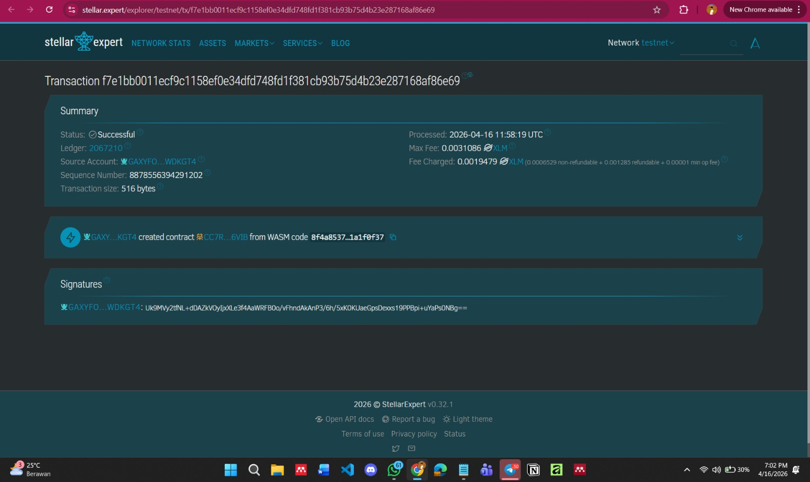

# Stellar Escrow DApp

**Stellar Escrow DApp** - Blockchain-Based Trustless Payment System

## Project Description

Stellar Escrow DApp is a decentralized smart contract solution built on the Stellar blockchain using Soroban SDK. It provides a simple and secure escrow mechanism between a client and a freelancer without relying on a third-party intermediary.

The contract allows users to create escrow agreements, where funds are logically locked within the system until specific conditions are met. Once the work is completed, the client can release the funds to the freelancer. If needed, the escrow can also be canceled before release.

All escrow data is stored directly on the blockchain, ensuring transparency, immutability, and trustless execution of agreements.

---

## Project Vision

Our vision is to simplify and secure digital transactions by:

- **Eliminating Middlemen**: Removing the need for third-party platforms in freelance transactions
- **Ensuring Trustless Execution**: Allowing agreements to be enforced automatically by code
- **Improving Transparency**: Making all escrow activities visible and verifiable on-chain
- **Reducing Costs**: Leveraging Stellar’s low transaction fees for efficient payments
- **Empowering Users**: Giving full control of funds and agreements to the participants

We envision a decentralized ecosystem where financial agreements can be executed fairly without relying on centralized authorities.

---

## Key Features

### 1. **Escrow Creation**

- Create a new escrow agreement between client and freelancer
- Define participants and payment amount
- Automatically generate unique escrow ID
- Store escrow data securely on-chain

### 2. **Escrow Retrieval**

- Fetch all escrow records in a single call
- View current status of each escrow
- Easy integration with frontend applications
- Real-time synchronization with blockchain data

### 3. **Fund Release Mechanism**

- Release escrow funds to freelancer
- Ensure funds are only released once
- Update escrow status after release
- Transparent execution visible on blockchain

### 4. **Escrow Cancellation**

- Cancel escrow before funds are released
- Prevent accidental or unwanted transactions
- Clean removal from storage
- Immediate update to escrow list

### 5. **Transparency and Security**

- All escrow activities recorded on blockchain
- Immutable transaction history
- Protection against unauthorized modifications
- Trustless interaction between users

---

## Contract Details

- **Contract ID**:
  - `CCJNWMTS6OM5DUF3BF6BZ4KHYP3AZ4IZTMPCOUXS2HXYMPYC5PIHHXE4`
  - `CC7RS3KPS6K3RYUFRNX6HRKGVD2UANYMCVPQY7JVPEJRBVNWTAFJ6VIB`

- **Explorer (Testnet Transaction)**:  
  https://stellar.expert/explorer/testnet/tx/f7e1bb0011ecf9c1158ef0e34dfd748fd1f381cb93b75d4b23e287168af86e69

- **Contract Interaction (Stellar Lab)**:  
  https://lab.stellar.org/r/testnet/contract/CC7RS3KPS6K3RYUFRNX6HRKGVD2UANYMCVPQY7JVPEJRBVNWTAFJ6VIB

---

## Future Scope

### Short-Term Enhancements

1. **Authentication (Auth)**: Restrict actions so only the client can release or cancel escrow  
2. **Real Token Transfer**: Integrate actual XLM or token transfers within the contract  
3. **Basic Validation**: Prevent invalid inputs and improve data integrity  
4. **Status Improvement**: Add more detailed escrow states (Pending, Completed, Cancelled)  

### Medium-Term Development

5. **Dispute System**: Add a mechanism for conflict resolution between client and freelancer  
6. **Multi-Signature Approval**: Require approval from both parties before releasing funds  
7. **Milestone-Based Escrow**: Break payments into multiple stages  
8. **Notification Integration**: Notify users when escrow status changes  

### Long-Term Vision

9. **Decentralized Freelance Platform**: Expand into a full freelance marketplace  
10. **Reputation System**: Add trust scores for users based on transaction history  
11. **Cross-Contract Integration**: Connect with other smart contracts  
12. **DAO Governance**: Community-based dispute resolution system  
13. **Decentralized Identity (DID)**: Integrate identity verification for users  
14. **Cross-Chain Escrow**: Enable escrow across multiple blockchain networks  

### Enterprise Features

15. **Business Contracts**: Use escrow for B2B agreements  
16. **Automated Payments**: Trigger payments based on predefined conditions  
17. **Audit Logs**: Immutable financial records for compliance  
18. **Scalable Payment Systems**: Support high-volume transactions  

---

## Technical Requirements

- Soroban SDK  
- Rust programming language  
- Stellar blockchain network  

---

## Getting Started

Deploy the smart contract to Stellar's Soroban network and interact with it using the main functions:

- `create_escrow()` - Create a new escrow agreement  
- `get_escrows()` - Retrieve all escrow data  
- `release_escrow()` - Release funds to freelancer  
- `cancel_escrow()` - Cancel an escrow before release  

---

**Stellar Escrow DApp** - Trustless Payments, Powered by Blockchain